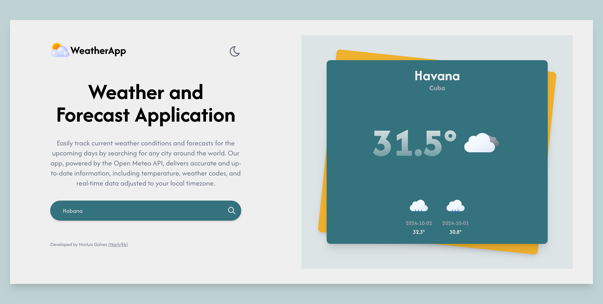
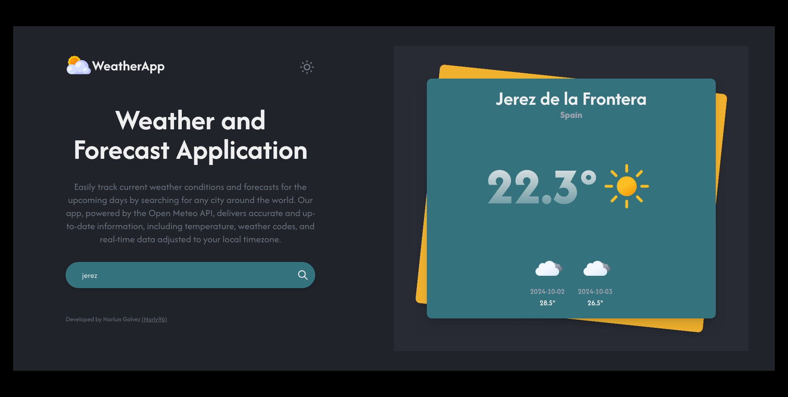

# WeatherApp

Easily track current weather conditions and forecasts for the upcoming days by searching for any city around the world. Our app, powered by the Open Meteo API, delivers accurate and up-to-date information, including temperature and weather codes.

### Screenshot





### Links

Deploy by Vercel

- Site URL: [WeatherApp]()

## Installation

To run this project on your local machine, follow these steps:

1. Clone the repository:

```bash
https://github.com/norly96/weatherApp-TS.git
```

2. Navigate to the project directory:

```bash
cd weatherApp-TS
```

3. Install the backend dependencies:

```bash
npm install
```

4. Set your environment variables. Create an .env file in the project root directory and add the API URL :

```bash
VITE_GEO_API_URL=https://geocoding-api.open-meteo.com/
VITE_BASE_API_URL=https://api.open-meteo.com/
```

5. Start the server

```bash
npm run dev
```

## Used technologies

1. HTML, CSS, TypeScript, ReactJS, TailwindCSS

2. API: [Open Meteo API](https://open-meteo.com/)

## Contact

Name: Norluis Galvez Sanchez
Website: [Norly96](https://norly96.com)
GitHub: [Norly96](https://github.com/norly96)
Linkedin: [Norly96](https://www.linkedin.com/in/norly96)
